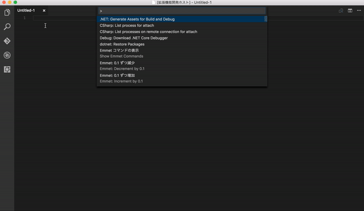

# README 

Smile Editor for VSCode 

It's joke extensions

 

## Extension Settings 

after installation to 6 step 

1. connect webcam to pc 

2. access to Microsoft's Emotion API [https://www.microsoft.com/cognitive-services/en-us/emotion-api](https://www.microsoft.com/cognitive-services/en-us/emotion-api)  

3. get Account and API key 

4. open settings.json 

5. add "emotions.key : "xxx" 
> emotions.key : "xxx" // "xxx" is your API key 

6. open your workspace folder 

7. let's smile working !! 

## Usage 

use the editor as usual 
photographing occasionally whether it is a smile or not !! 

at the time if there was a smile there was nothing 
but there was a not smile to erase the active window file chars 

## Copyright
node-webcam

The MIT License

Copyright (c) 2016 Chuck Fairy http://chuckfairy.com

Permission is hereby granted, free of charge, to any person obtaining a copy
of this software and associated documentation files (the "Software"), to deal
in the Software without restriction, including without limitation the rights
to use, copy, modify, merge, publish, distribute, sublicense, and/or sell
copies of the Software, and to permit persons to whom the Software is
furnished to do so, subject to the following conditions:

The above copyright notice and this permission notice shall be included in
all copies or substantial portions of the Software.

THE SOFTWARE IS PROVIDED "AS IS", WITHOUT WARRANTY OF ANY KIND, EXPRESS OR
IMPLIED, INCLUDING BUT NOT LIMITED TO THE WARRANTIES OF MERCHANTABILITY,
FITNESS FOR A PARTICULAR PURPOSE AND NONINFRINGEMENT. IN NO EVENT SHALL THE
AUTHORS OR COPYRIGHT HOLDERS BE LIABLE FOR ANY CLAIM, DAMAGES OR OTHER
LIABILITY, WHETHER IN AN ACTION OF CONTRACT, TORT OR OTHERWISE, ARISING FROM,
OUT OF OR IN CONNECTION WITH THE SOFTWARE OR THE USE OR OTHER DEALINGS IN
THE SOFTWARE.
